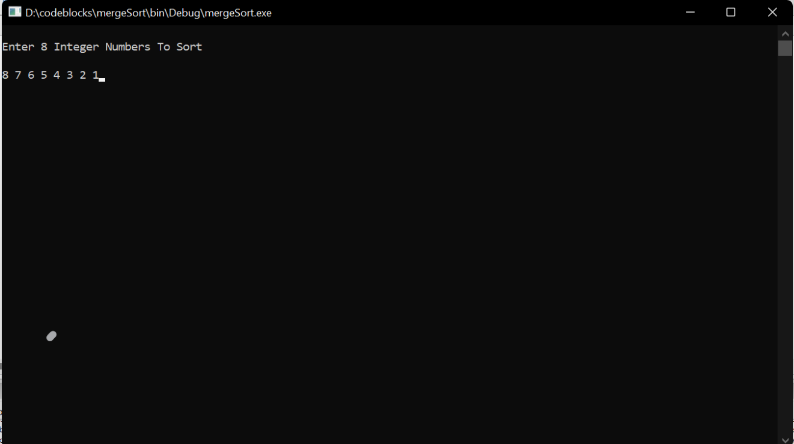
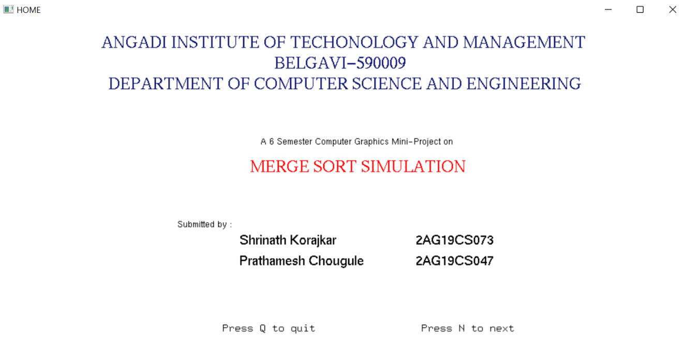
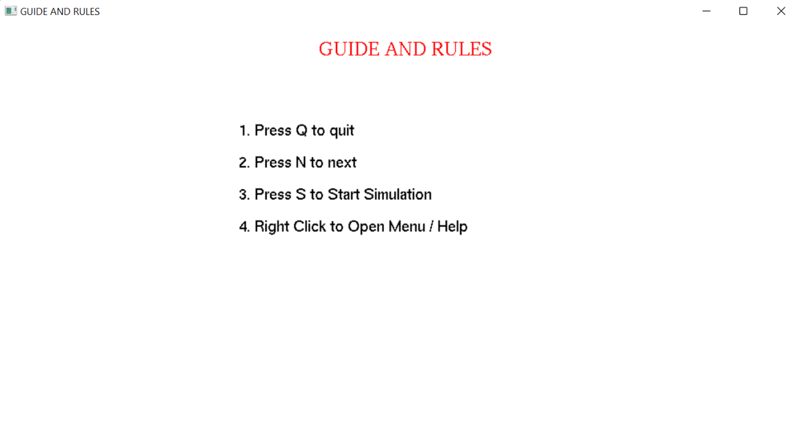
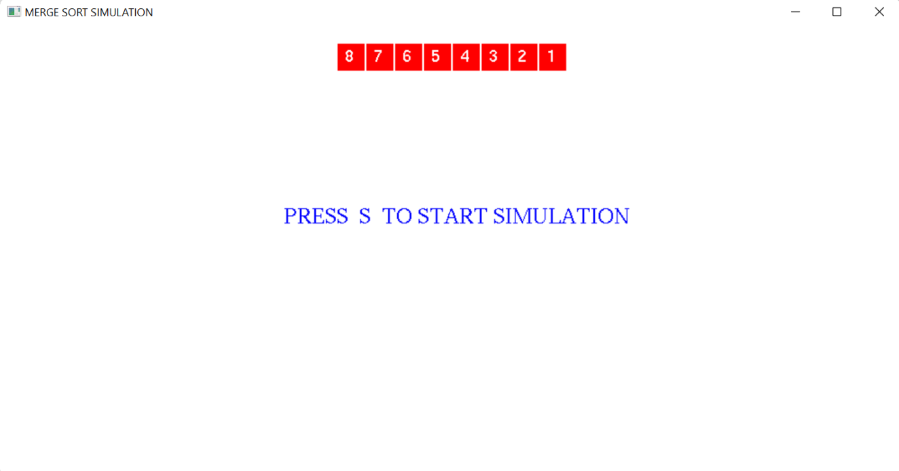
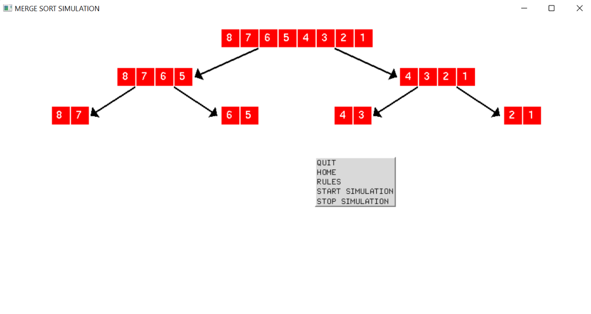
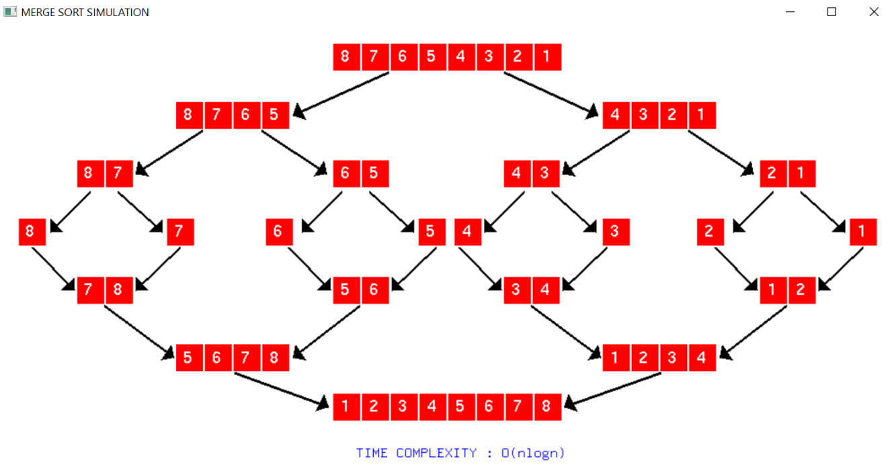

# MergeSort_OpenGL
Merge Sort Simulation Using OpenGL. This project was developed as a mini project for academic requirements in respect of mini-project work prescribed for the Bachelor of Engineering degree.

## ABSTRACT
The purpose of the project is to develop an graphics simulation to show the working of Merge Sort algorithm (external algorithm and based on divide and conquer strategy). In this sorting: The elements are split into two sub-arrays (n/2) again and again until only one element is left. Merge sort uses additional storage for sorting the auxiliary array. Merge sort uses three arrays where two are used for storing each half, and the third external one is used to store the final sorted list by merging the other two and each array is then sorted recursively. At last, all sub-arrays are merged to make it ‘n’ element size of the array. This project creates a 2-D/VIRTUAL view of Merge Sort. Here, we have created a simulation consisting of the merge sort which take user input and sort it using merge sort algorithm, then display various steps involved in sorting the given array. It is helpful for the visual understanding of the working of merge sort. It is easy to understand also we have provided mouse interface to start and stop simulation and to exit the window. We have also included the keyboard input function to traverse between the windows.

# SETUP AND RUN
### Software Requirements
1. [CODE BLOCKS IDE](https://sourceforge.net/projects/codeblocks/files/Binaries/20.03/Windows/codeblocks-20.03mingw-setup.exe/download)
2. [FREE GLUT LIBRARY](https://www.transmissionzero.co.uk/files/software/development/GLUT/freeglut-MinGW.zip)

### To Run
1. Add the free glut library files into code blocks installation folder. [watch on youtube](https://youtu.be/dqUKw0WDaY8)
2. Create new c/c++ file in codeblocks copy the code written in main.cpp and run the file

# RESULTS
**Input Page**

**Home Page**

**Rules Page**

**Start Page**

**Live Simulation**

**Completion of Simulation**

# Further Enhancements:
  The following are some of the features that can be included in the revised versions of this code are:
1. Generalize it for variable input length.
2. Include good animation for displaying the layers.
3. Support for advanced 3D representation of the entire scenario.
4. Support for transparency of layers and originality.
5. Make the code responsive.

